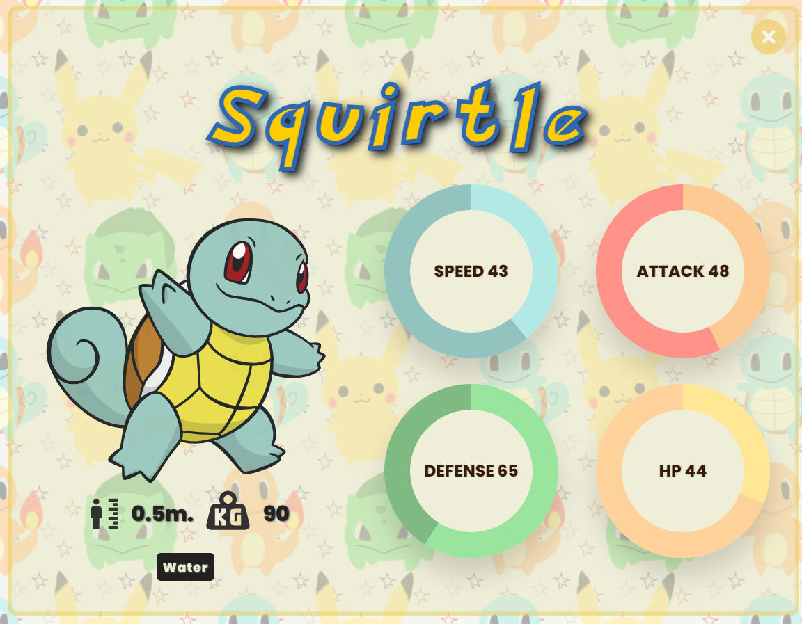

# Pokémon

A fully responsive Application built with Node.js, Express, Postgre, Secqualize, React, Redux, and Vite  consuming the public PokéApi. (includes testing)

## Frontend

Main Screen

Intro

Detail

Card detail
